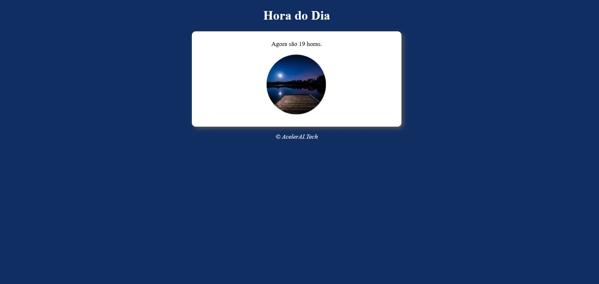

# Hora do Dia

Um projeto em **HTML, CSS** e **JavaScript** para exibir uma mensagem de saudação com base na hora do dia. O fundo e a imagem mudam automaticamente para refletir o período atual (manhã, tarde ou noite).

## Demonstração
O projeto exibe uma página simples com:
- Saudação e horário atual.
- Imagem e cor de fundo que mudam conforme a hora do dia.

## Funcionalidades
- Exibição de Horário: Mostra a hora atual no formato de 24 horas.
- Mudança de Fundo e Imagem: Adapta automaticamente a cor de fundo e a imagem conforme o período do dia:
   - **Manhã (0h-12h)**: Mostra uma imagem e fundo representando a manhã.
   - **Tarde (12h-18h)**: Mostra uma imagem e fundo representando a tarde.
   - **Noite (18h-24h)**: Mostra uma imagem e fundo representando a noite.
 
## Explicação do Código
- **index.html:** Estrutura principal da página com cabeçalho, mensagem e espaço para imagem.
- **style.css:** Define o estilo, cor de fundo e layout da página.
- **script.js:** Lógica de mudança de saudação, imagem e fundo com base no horário do dia.

Abaixo está uma amostra de como a página exibe a mensagem e a imagem de acordo com a hora do dia:

